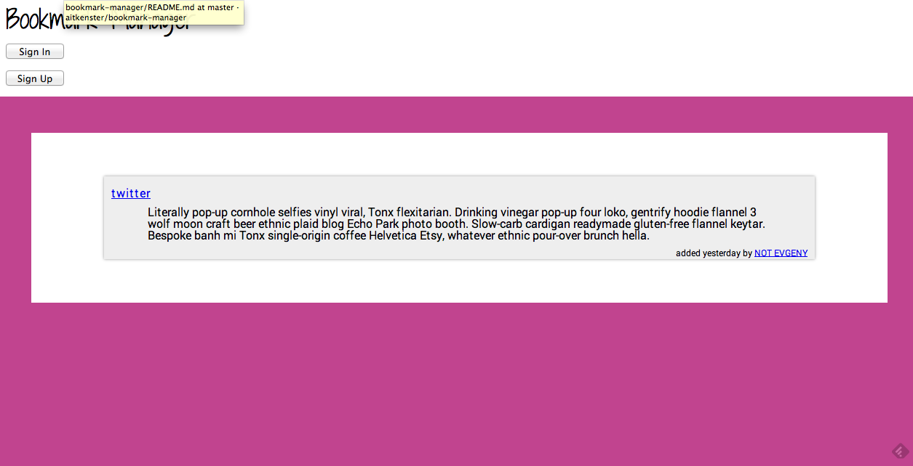

Bookmark Manager
==========

This was a pair programming project completed by myself and csharpd during week 6 of Makers Academy

The aim of this project was to learn about integration testing, relational databases, and web application security.

It is a sinatra application, built using Ruby, PSQL, Datamapper and BCrypt, and tested with RSPEC and Capybara.

Screenshot:


View the app here: http://secure-woodland-8276.herokuapp.com

###Specification
+  Allows users to save and tag web links
+  Users can log in, log out and reset passwords
+  Users can filter their list of links by tags

###Technologies used

+ Ruby
+ PSQL
+ Datamapper
+ BCrypt
+ HTML
+ CSS
+ RSPEC
+ Capybara
+ Sinatra
+ Heroku
+ REST-client

###How to set it up

```sh
git clone https://github.com/aitkenster/bookmark-manager.git
cd bookmark-manager
bundle install
```

###How to run it

```sh
cd bookmark-manager
rackup
```

visit localhost:9292 in the browser to view the program.

###How to test it

```sh
cd bookmark-manager
rspec
``` 

###Future Improvements

+ Provide fields to add some description text with each link. Currently it just displays default text.
